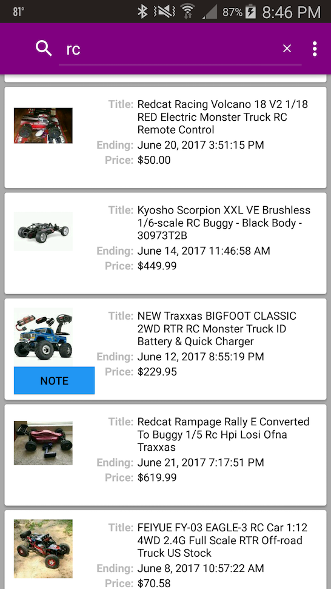
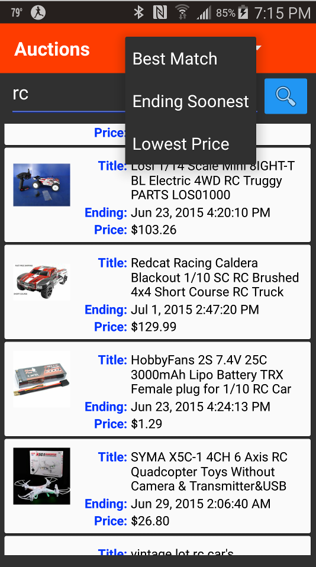
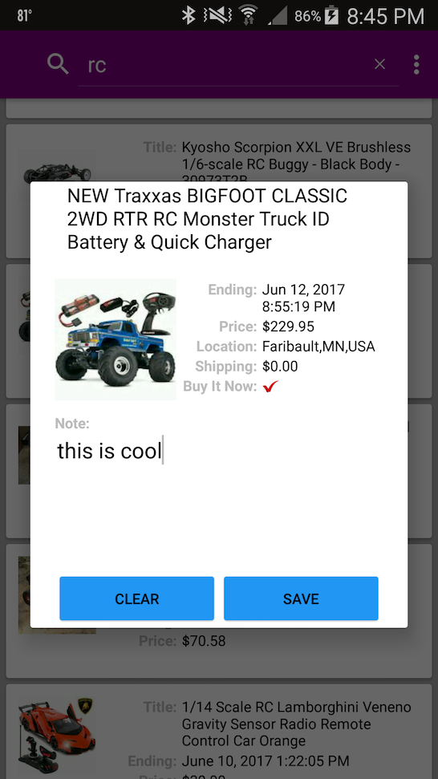

# Auction Browser

### Android Material Design Reference App

* Gradle Dependency on [AppFramework Library](https://github.com/balch/MockTrade#application-framework)
    * MVP
    * [Source](https://github.com/balch/MockTrade/tree/master/AppFramework)
* Uses Volley to query [EBay API](http://developer.ebay.com/Devzone/finding/CallRef/findItemsByKeywords.html)
* RecyclerView with endless scrolling pattern
* local SQL storage for user attached note

